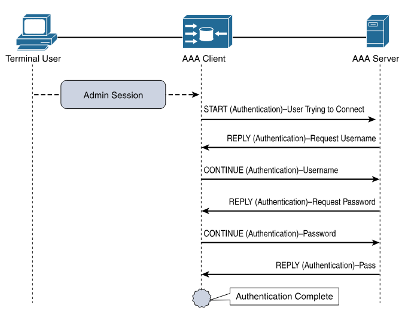
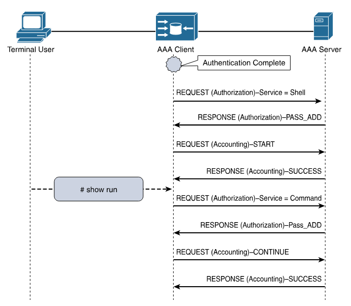

# Terms

* **RADIUS** - Remote Authentication Dial-In User Service. Created to provide AAA for ISP users, or Dial-In for businesses.
* **TACACS** - Terminal Access Controller Access-Control System. An AAA protocol to provide support for authenticate once, authorize many.
* **TACACS+** - Same as above, basically an upgraded version, not backward compatible.
* **EAP** - Extensible Authentication Protocol, 802.1x, used for LAN Auth, only works with RADIUS.

### TACACS+ Flows

